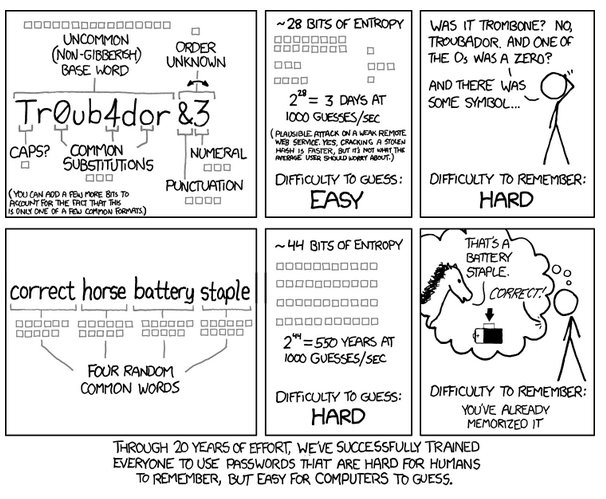

# Lecture 0 - Securing Accounts

## Security

- We might imagine security in the real world as a key to a physical lock.
- In the digital world, there are numerous building blocks to security.
- Authorization is the act of verifying that you are, indeed, the person who should have access to this account.
- Usernames are one way that you attest that you should have access to an account.
- Passwords are another way that you attest that you should have access to an account.
- The idea is that, theoretically, only you should be able to provide both a valid username and password.
- Dictionary attacks are one way that bad actors attempt to guess your password. Indeed, hackers may use a “brute-force attack” by trying lengthy lists of possible passwords to attempt to guess your password. Therefore, it’s very important you defend against attacks by having a very good password.
- When considering security, one should consider the tradeoffs between usability and security. A highly secure service may become less usable. Hence, as you consider your options for maintaining security, think about what makes the most sense for your use case.


## Defending Against Attacks

- Consider how many possible number combinations you could have if your password (for your phone or otherwise) was secured by only a four-digit password. There are 10,000 possible digits. Generally, we could consider the possibilities as follows:
```
10 x 10 x 10 x 10
```
Notice that, in the worst case, bad actors would need to attempt 10,000 possible passwords.
- We could attempt to represent this in code. VS Code is a development environment whereby we can write and execute code.
- Consider the following code-based representation of the above problem:
```
from string import digits

for i in digits:
    for j in digits:
        for k in digits:
            for l in digits:
                print(i, j, k, l)
```
Notice that this code, written in Python, iterates through each possible combination of numbers
- Executing crack.py in a terminal window (where we can issue commands to our computer), we can see that it takes only a few milliseconds for adversaries to produce all the possible passwords.
- What would happen if we asked for a password that was four letters?
- If we allow for both uppercase and lowercase versions of 26 letters, we could represent this mathematically as:
```
52 x 52 x 52 x 52
```
Notice we have over 7,000,000 possibilities.
- We can modify our code as follows:
```
from string import ascii_letters
 
for i in ascii_letters:
    for j in ascii_letters:
        for k in ascii_letters:
            for l in ascii_letters:
                print(i, j, k, l)
```
Notice that we invoke ascii_letters, which includes uppercase and lowercase versions of each letter. Similar to our previous program, this program iterates through all possible combinations.
- Executing this code, we discover that it still does not take much effort at all for a hacker to discover all possible passwords.
- What would happen if we asked for a password that was four letters, numbers, or punctuations? We would have over 78,000,000 possibilities open to us!
- We can modify our code as follows:
```
from string import ascii_letters, digits, punctuation

for i in ascii_letters + digits + punctuation:
    for j in ascii_letters + digits + punctuation:
        for k in ascii_letters + digits + punctuation:
            for l in ascii_letters + digits + punctuation:
                print(i, j, k, l)
```
- Executing this code, we notice that it takes significantly longer to discover all possible passwords in the worst case.
- The most important takeaway from the above is that as long as we raise the bar for the adversary in terms of time, the less likely the adversary will have the time to crack your password. However, the difficulty for the user is that longer, more complex passwords take longer to type and are more difficult to remember. Therefore, there is a balance between security and usability.


## National Institute of Standards and Technology (NIST)

- NIST issues recommendations on how to protect your accounts more effectively.
- You can use their recommendations and best practices in your own work and, perhaps, at your place of employment or business. Some of their recommendations include the following considering passwords (paraphrased for brevity):

    - Memorized secrets should be at least eight characters in length.
    - Verifiers should allow all printed ASCII characters and Unicode symbols up to 64 characters in length.
    - Verifiers should compare prospective secrets against available dictionary words, repeat sequences, breached password lists, and context-specific words.
    - Verifiers should not allow unauthenticated claimants to access password hints.
    - Verifiers should not require periodic changes to passwords.
    - Verifiers should limit the number of failed authentication attempts and lock out potential adversaries.


## Two-Factor Authentication (2FA) or Multi-Factor Authentication (MFA)

- There are three components of multi-factor authentication.
    - Knowledge: Something only you know.
    - Possession: An item or device only possessed by an authorized user.
    - Inherence: Only a factor you could obtain, like your fingerprint, face, or other biometrics.


## One-Time Password (OTP)

- One could obtain a special key fob or device that provides one-time passwords.
- Frequently, OTPs are obtained from a device or app.
- Some of these OTP methods are more secure than others.
- Text-message-based OTPs can be quite easy to be fooled through SIM swapping, where an adversary obtains and clones a SIM card and gets access to your text messages.
- More secure are OTPs obtained from an app on a secure device, like an authentication app on your phone.


## Keylogging

- Usernames, passwords, and OTPs are vulnerable to adversaries logging your keystrokes.
- Keylogging is accomplished by installing malicious software on a computer.
- Best to ensure you are only logging onto devices to which you only have access.


## Credential Stuffing

- Another attack, credential stuffing, involves the use of an obtained list of usernames and passwords from a compromised website on another website.
- If you are using the same password on multiple websites, best to change them to unique passwords.


## Social Engineering

- Rather than a technological attack, a social engineering attack involves the use of social pressure and trust to compromise your credentials.
- A person may pose as a trusted party to get your credentials or details about your life.
- Furthermore, adversaries may seek to find details about your life, like your pet’s name, etc.


## Phishing

- Phishing uses social engineering in a technological way to obtain your credentials and details by posing as a trusted website.
- For example, you may be directed to something that looks like a Google login page but is, in fact, an adversaries page.
- Never blindly trust links provided in emails. Consider going to a web browser and directly typing a trusted URL there.


## Machine-in-the-Middle Attacks

- Devices in between you and the source of the data you are downloading, such as routers and switches, can be compromised by very sophisticated attackers.


## Single Sign-On (SSO)

- Since so many different services require so many varying password requirements and considering the advice offered earlier about never utilizing the same password for different services, there are many ways you can bolster your security.
- SSO allows you to use Google or Facebook logins to access services not provided by Google or Facebook.
- Therefore, you have the ability to easily access other services with less friction and greater security.


## Password Managers

- A password manager is a piece of software that can manage complex passwords and save them for you.
- This allows you to not memorize the password.
- Further, many password managers will recognize phishing websites.
- Different from browser password-saving, which has been available for years, password managers are a separate piece of software that can provide your password in multiple services.
- The downside is that, effectively, you are “putting all your eggs in one basket.” You will need to remember one password to access all the other passwords.


## Passkeys

- An emerging technology, passkeys are automatically generated passwords that leverage cryptography.
- Passkeys involve a public key and a private key. The public key is held by a service (such as a website), while the private key is held by your device.
- Passkeys will enable you to log in without the need to type in a password.
- However, to understand more about this technology, we will need to learn more about cryptography.


# Assignment 0 - 10/10

**If I have a six-character password consisting of uppercase (English) letters and (decimal) digits only, how many seconds might it take an adversary to crack, assuming they make one attempt per second?**
2176782336

**Humor us for a moment, and play The Password Game, trying to get through at least Rule 12. While obviously the game itself is in many ways meant to be humorous, it also critiques the experience many of us have setting up new passwords. Explain how there's a trade-off between usability and security in the context of passwords.**
This happens because a password can either be a secure password and for that the website/app would require the new user to set a password with a lot of rules that will make the user create a password that it'll most likely difficult to remember.

**Consider the below comic for the next two questions.**


**Consider the top row of the comic above. Why are passwords like those easy (for a computer) to guess but hard (for a human) to remember?**
Because the computer can run a program that will test all of the possibilities for 11 digits passwords that contain upper and lower case letters, numbers and symbols in a couple of seconds or minutes, but as it's not a word, and it even has symbols and numbers in the middle of the letters it makes it really hard for a person to remember.

**Now consider the bottom row of the comic above. Why are passwords like those hard (for a computer) to guess but easy (for a human) to remember?**
Because has it is a 25 digits password, even if it's just composed by lower case letters, the computer would have to test (in the worst case) 26^25 different passwords, what would take a long time, while for a person, as it's a well constructed sentence with dictionary words, that we are used to, it'll be easier to remember.

**What is a "credential stuffing" attack?**
It's an attack where the attackers use lists of stolen usernames and passwords, from some site, and try to use those combinations in other sites.

**Provide a specific example of something that would be considered a type of knowledge factor for authentication purposes.**
A memorable date

**Provide a specific example of something that would be considered a type of inherence factor for authentication purposes.**
Facial recognition

**Why are phishing attacks so difficult to prevent?**
Because they are dependent on the gullibility of each person to believe the links they are sent, and to whether or not they are trust worthy and if they should or not give the information that it's asked for.

**Suppose that your boss asks you whether the company should require use of password managers for all employees. Explain in a short paragraph why you might want everyone in the company to use a password manager.**
Because the password manager will store the passwords for the employees in a secure way, that is better than a sheet with all their passwords in their desks or something like that, that would be easily accessible by others. Besides that, as the employees would not have to remember all the passwords, they would most likely create better passwords, that differ from site to site, and are not all the same. So, with the help of a password manager, the security of the company would increase.
